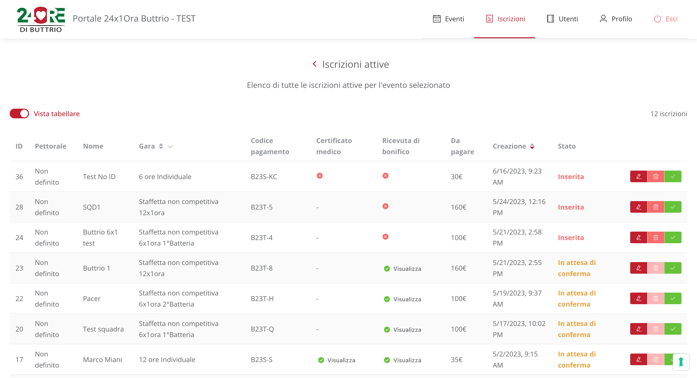

# 24x1ora_frontend

Web application to manage [*24x1Ora di Buttrio*](https://24oredibuttrio.it/) races, teams and individual participants.

## Technologies

* [Vue.js 3](https://vuejs.org/) framework

* [Element Plus](https://element-plus.org/en-US/) components library

* [TypeScript](https://www.typescriptlang.org/) programming language

## Project setup

### Development

Install project dependencies:

```sh
npm install
```

Run development server:

```sh
npm run dev
```

### Production

Compile project:

```sh
npm run build
```

### 
